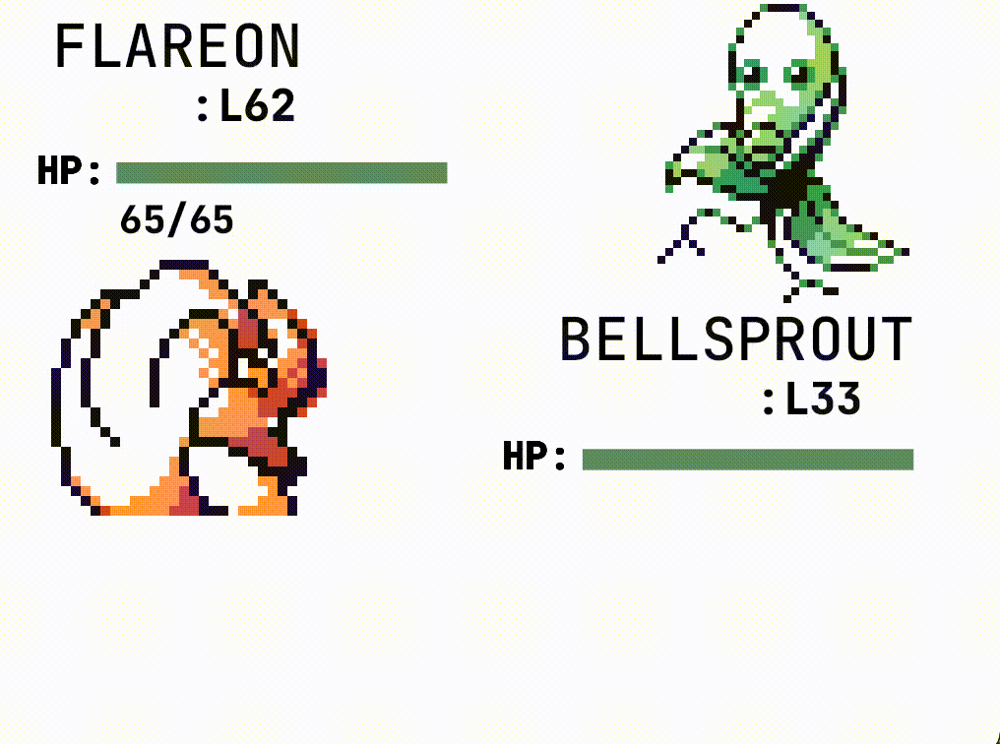

# konkuRRenz
 
 
 # Genesis
 konkuRrenz is a Pokemon Battle Emulator which seeks to emulate the layout and generic sprite flexibility in 
 Pokemon. Specifically, the sprites, layout, and inspiration all come from Pokemon Blue.

 After experimenting with queries and generic bevy foundations in [rpong](https://github.com/Gearhartlove/rpong), I wanted to learn more about UI 
 and text elements in bevy. How to spawn them, edit their sizes, dynamically resize them, and debug their
 components at run time. All of these goals and more were met with this project. I now feel much more comfortable
 and confident with text, buttons, sprites, and assets in bevy. 
 
 My most proud accomplishment for this project, was scraping a specific pokemon website and downloading all of the images for the 
 Generation 1 Pokemon. I could have downloaded all 302 sprites manually, but I am far too lazy for that approach. So instead, I wrote
 a script which will look for every desired sprite image and then download it into the project. The basic logic (/battle_plugin/src/pokemon_generation) 
 goes as: 
 * Get the html of the page
 * Look for every fragment with the **img** selector
 * If the fragment is a sprite, get the **src** and **alt** attributes
 * A basic parse is performed and then the image is downloaded and the image is parsed! 

 I feel more and more comfortable reading an api for a crate and bringing it into my project! All of this was done with pure Rust, which 
 I am really proud of :)
 
 I also node that: I payed more attention to code readability and consistency throughout this project, especially when compared to 
 the rushed rpong. The file structure is in the format of a plugin, which could be used in another bevy project. However, it is not correctly
 decoupled from main at the moment. I toyed around with making a user friendly api for konkeRRenz, however in the end I decided to focus on
 the features. Notably, the space below the screen is absent, as that is where the user actions go for in Pokemon Blue. I decided to not include them 
 in this project, as I have spent around 6 days on this project and recognise it's time to move onto the next! It is a feature you could implement if 
 you would like to :)
 
 The main components of this project included:
 * Generic Fighter Sprite Foundation 
   *  Fighter Struct
    *  Ally and Enemy enum 
 * Importing and Accessing Generation 1 Pokemon
   *  Web Scraping
   *  Parsing Pokedex csv for pokemon specific information
 * Updating Battle with new Fighters
